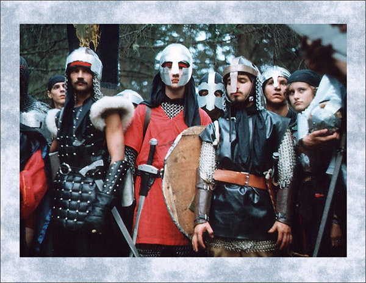
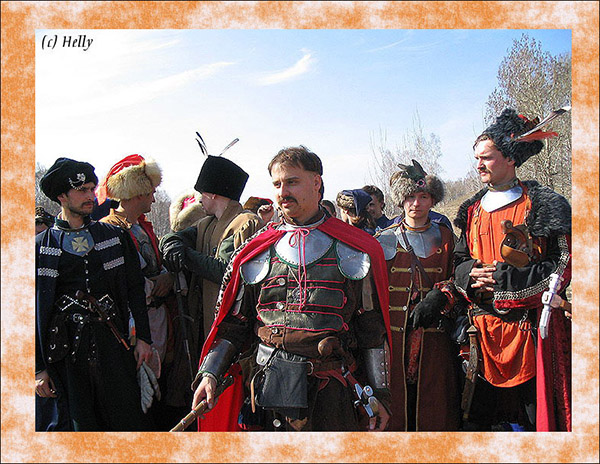
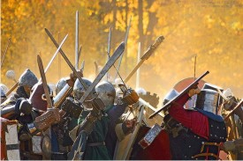
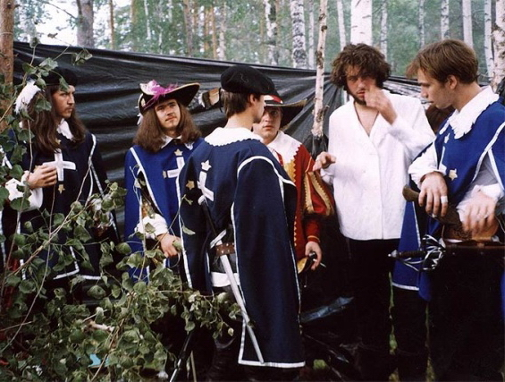
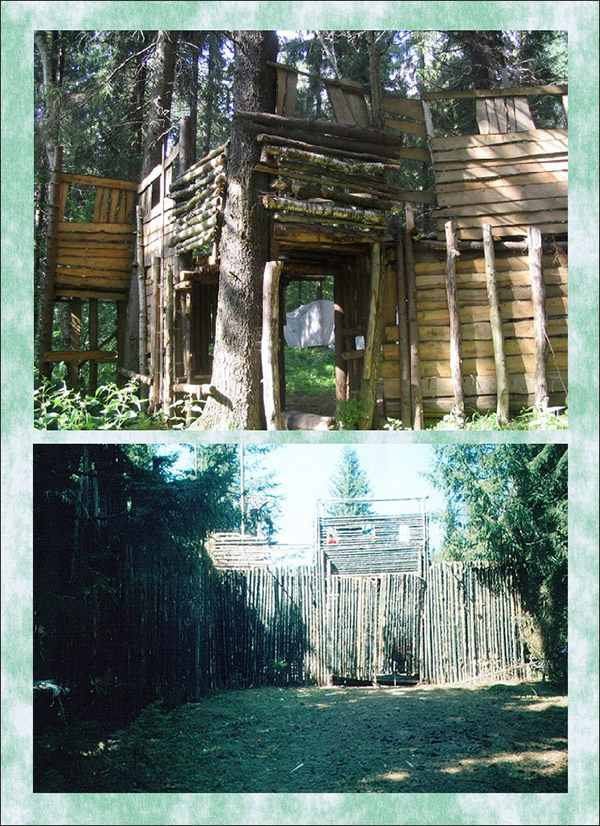
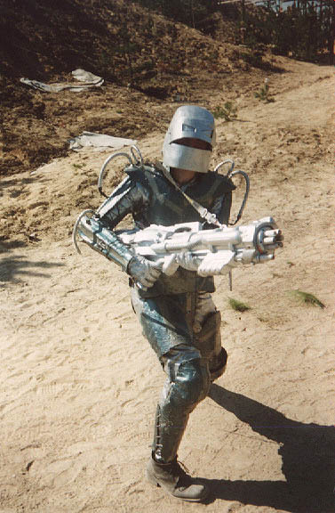
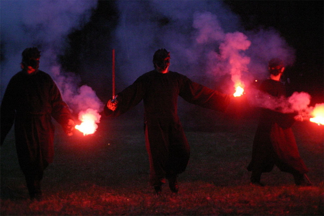

# Галерея

Глядя на фотографии с игры, словно смотришь в открытые окна других миров. Что
это за люди, какие у них судьбы, к чему они стремятся?.. Воины с игры “Тени
Империи” (1998).

Казацкое войско – кто скажет, что эти ребята не настоящие казаки? Игра “Огнем и
мечом” (2005) по одноименному роману Г. Сенкевича.

Кельтская мифология оказала огромное влияние на мировую культуру. Яркие и
красивые образы были созданы участниками игры по ирландскому фольклору.
Павильонная игра “Павия”(2005).

Королевские мушкетеры пришли с визитом в Бастилию. «Война и мир» (2003).

Крепости, выстроенные специально для игры. Их можно штурмовать и оборонять
согласно игровым правилам. Сверху вниз: “Черный отряд” (2006) и “Хоббитские
игрища”(2002).

Достоверно и артистично сыграть можно даже совершенно фантастических
персонажей. Тяжелый боевой киборг, игра «Киберпанк» (2001).

Огнедышащий Дракон. Те, кто видели его воочию, говорят, что это было жуткое и
завораживающее зрелище. Но даже на фотографии видно – красиво и страшно. Игра
«Его Величество Дракон» (2005).
